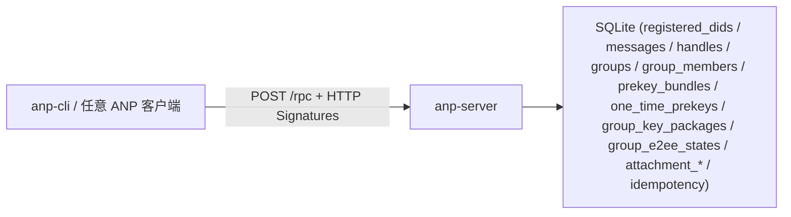

# anp-server 独立服务器

ANP 协议裸服务器——与你本地的 anp-cli 通信的 SQLite 持久化后端。

- **位置**：与 `anp-cli` 并列的独立仓库
- **模块**：`github.com/eccstartup/anp-server-go`（独立于 CLI，无交叉依赖）
- **协议**：`POST /rpc`，JSON-RPC 2.0 + HTTP Message Signatures（[协议文档](../anp-cli/docs/protocol.md)）

## 快速启动

```bash
cd anp-server-go
go run ./cmd/anp-server
# 输出：http://127.0.0.1:8765
# stderr：[anp-server] listening on http://127.0.0.1:8765  (db: /tmp/anp-server-xxxxx.db)
```

或持久化数据库（推荐手测用）：
```bash
go run ./cmd/anp-server --db ./data.db
# 重启后数据不丢失
```

换端口 / 对外监听（默认 `8765`，一般不用改；`--port 0` 表示随机）：
```bash
go run ./cmd/anp-server --host 0.0.0.0 --port 9000 --db ./data.db
```

## 与 CLI 一起测试

**终端 A**（起服务器）：
```bash
cd anp-server-go
go run ./cmd/anp-server --db ./data.db
# 默认固定端口：http://127.0.0.1:8765
```

**终端 B**（用 CLI 操作）：
```bash
export ANP_WORKSPACE=/tmp/my-test
export ANP_BACKEND=http://127.0.0.1:8765

anp-cli init alice
anp-cli register --handle alice.agent
anp-cli msg send --to did:wba:ex:bob --text "hello"
anp-cli msg inbox --format table

# 重启服务器后数据还在——
# Ctrl-C 终端 A 的服务器，重新启动 go run ./cmd/anp-server --db ./data.db
# 终端 B 直接继续：
anp-cli register --handle alice.agent   # 幂等，不报错
anp-cli msg inbox --format table         # 之前发的消息还在
```

## 签名模式

服务器有**两层安全**：
1. **首次引导期**（未注册任何 DID 时）：接受所有请求，CLI 无需签名即可使用
2. **有已注册 DID 后**：后续请求需携带 HTTP Message Signatures，服务器用 SDK 验证签名并提取请求者 DID

## 暴露的方法

本 server 实现 **ANP 分层协议**：Base 语义层（明文 transport-protected，合规）之上叠加可选的安全覆盖层（E2EE）：

| method | 说明 |
|--------|------|
| `direct.send` | direct 消息（`anp.direct.base.v1` 明文 / `anp.direct.e2ee.v1` 加密） |
| `direct.incoming` | direct 推送通知（占位，OPTIONAL） |
| `direct.e2ee.publish_prekey_bundle` | 发布预密钥 bundle |
| `direct.e2ee.get_prekey_bundle` | 获取对方预密钥 bundle |
| `group.create` / `group.get_info` | 创建 / 查询群组 |
| `group.join` / `group.add` / `group.remove` / `group.leave` | 群组成员管理 |
| `group.update_profile` / `group.update_policy` | 更新群组资料 / 策略 |
| `group.send` | 群组明文消息 |
| `group.incoming` / `group.state_changed` | 群组推送通知（占位，OPTIONAL） |
| `group.rebind_member` | 成员身份重新绑定（新 DID） |
| `group.e2ee.publish_key_package` / `group.e2ee.get_key_package` | 群组 E2EE 密钥包发布 / 获取（P6，MLS 对象不透明存储） |
| `group.e2ee.create` / `add` / `remove` / `send` / `notice` | 群组 E2EE 控制面（P6，仅存储/转发 MLS 对象，MLS 计算在 agent 侧） |
| `attachment.create_slot` / `commit_object` / `abort_object` / `get_download_ticket` | 附件控制面（P7）+ 数据面 `PUT /upload/{slot_id}` / `GET /objects/{object_id}` |
| `msg.inbox` | 收件箱（direct + 群组消息，返回 `{server_seq, meta, body}`） |
| `did.resolve` | 解析 DID 或 handle |
| `did.register_document` | 注册 DID 文档（引导用） |
| `handle.register` | 注册 WNS handle（`localpart.domain`）；重复注册 → handle_taken |
| `handle.recover` | 恢复 handle（phone / email / recovery OTP 任一匹配，重新绑定） |

附加能力：**P8 联邦**（`serviceDid` 服务级签名 + `operation_id` 幂等去重）、**P9 提及**（`mentions` 字段轻量校验 + 透传）。

任何实现 ANP 标准（did:wba + RFC 9421 签名 + base/e2ee profile）的第三方客户端都能直接连接。

## 测试

```bash
cd anp-server-go
go test ./...       # 首次引导 / 抢注 / 持久化 / 请求体上限 / 注册安全 / handle 恢复 / 错误码 / SSRF 防护 / 群组生命周期 / 群组权限 / 群组发送 / direct 明文 / dispatch 路由
go vet ./...
```

## 架构



## 目录结构

```
anp-server-go/
├── cmd/anp-server/main.go      # 入口：参数解析 + 监听 + 优雅关闭
└── internal/server/            # server 包（单 package，按领域分文件）
    ├── server.go               # Server 类型 + 生命周期（New/Close/Start/Handler/JSONSnapshot）
    ├── rpc.go                  # JSON-RPC 入口、错误码、dispatch 路由
    ├── auth.go                 # HTTP Message Signature 验证
    ├── did.go                  # DID 注册/解析 + SSRF 防护
    ├── handle.go               # handle register/recover（WNS localpart.domain）
    ├── msg.go                  # inbox（direct + 群组消息）
    ├── group.go                # 群组 base 语义（12 个 JSON-RPC 方法）
    ├── group_e2ee.go           # 群组 E2EE 控制面（P6，MLS 对象不透明存储/转发）
    ├── e2ee.go                 # direct.send（base 明文 / e2ee 加密）+ prekey bundle + origin proof
    ├── attachment.go           # 附件控制面 + 数据面（P7）
    ├── mentions.go             # 群消息 mentions 校验（P9）
    ├── schema.go               # SQLite schema + 迁移
    └── helpers.go              # 小工具函数
```

`internal/` 是 Go 的约定：其下包仅本模块可见，外部项目无法 import，明确表达「这是内部实现、不是公共 API」。
