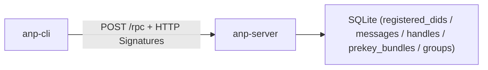

# anp-server 独立服务器

ANP 协议裸服务器——与你本地的 anp-cli 通信的 SQLite 持久化后端。

- **位置**：与 `anp-cli` 并列的独立仓库
- **模块**：`github.com/eccstartup/anp-server-go`（独立于 CLI，无交叉依赖）
- **协议**：`POST /rpc`，JSON-RPC 2.0 + HTTP Message Signatures（[协议文档](../anp-cli/docs/protocol.md)）

## 快速启动

```bash
cd anp-server-go
go run ./cmd/anp-server
# 输出：http://127.0.0.1:8765
# stderr：[anp-server] listening on http://127.0.0.1:8765  (db: /tmp/anp-server-xxxxx.db)
```

或持久化数据库（推荐手测用）：
```bash
go run ./cmd/anp-server --db ./data.db
# 重启后数据不丢失
```

换端口 / 对外监听（默认 `8765`，一般不用改；`--port 0` 表示随机）：
```bash
go run ./cmd/anp-server --host 0.0.0.0 --port 9000 --db ./data.db
```

## 与 CLI 一起测试

**终端 A**（起服务器）：
```bash
cd anp-server-go
go run ./cmd/anp-server --db ./data.db
# 默认固定端口：http://127.0.0.1:8765
```

**终端 B**（用 CLI 操作）：
```bash
export ANP_WORKSPACE=/tmp/my-test
export ANP_BACKEND=http://127.0.0.1:8765

anp-cli init alice
anp-cli register --handle alice.agent
anp-cli msg send --to did:wba:ex:bob --text "hello"
anp-cli msg inbox --format table

# 重启服务器后数据还在——
# Ctrl-C 终端 A 的服务器，重新启动 go run ./cmd/anp-server --db ./data.db
# 终端 B 直接继续：
anp-cli register --handle alice.agent   # 幂等，不报错
anp-cli msg inbox --format table         # 之前发的消息还在
```

## 签名模式

服务器有**两层安全**：
1. **首次引导期**（未注册任何 DID 时）：接受所有请求，CLI 无需签名即可使用
2. **有已注册 DID 后**：后续请求需携带 HTTP Message Signatures，服务器用 SDK 验证签名并提取请求者 DID

## 暴露的方法

| method | 说明 |
|--------|------|
| `msg.send` | 发消息（to/group + body） |
| `msg.inbox` | 收件箱（scope: all/direct/group） |
| `msg.history` | 会话历史（with + limit） |
| `group.create/join/leave/members` | 群组生命周期 |
| `did.resolve` | 解析 DID 或 handle |
| `did.register_document` | 注册 DID 文档（引导用） |
| `handle.register` | 注册 handle；重复注册 → handle_taken |
| `handle.recover` | 恢复 handle |
| `direct.send` | E2EE direct 加密消息 |
| `direct.e2ee.publish_prekey_bundle` | 发布预密钥 bundle |
| `direct.e2ee.get_prekey_bundle` | 获取对方预密钥 bundle |

## 测试

```bash
cd anp-server-go
go test ./...       # 3 项测试：首次引导 / 抢注 / 持久化
go vet ./...
```

## 架构


